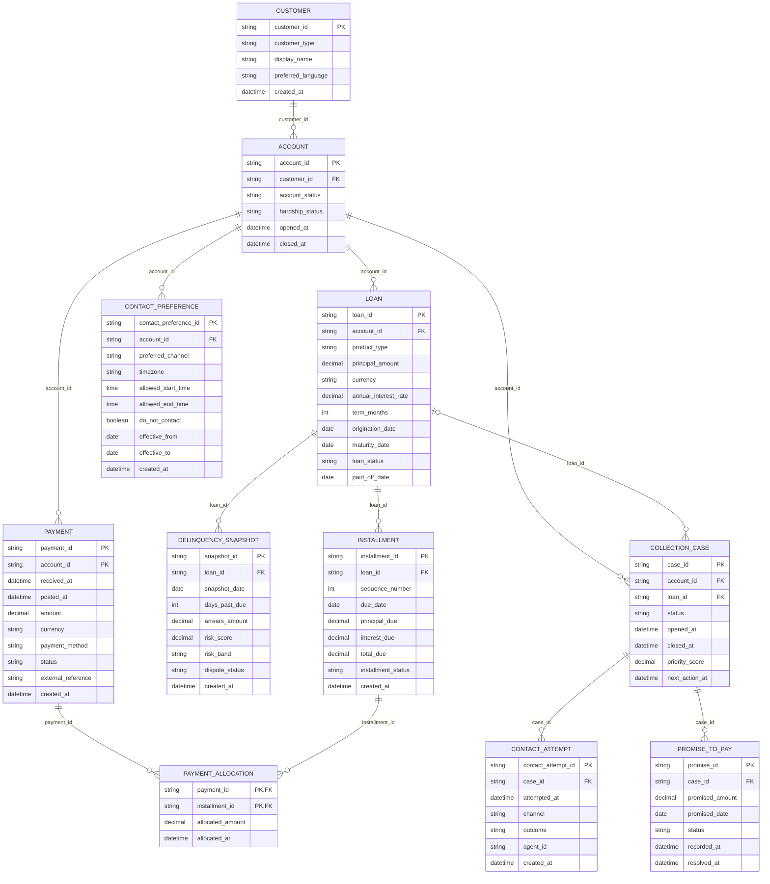

# Entity relationship diagram

<!-- Generated by tools/generate_schema.py from schema/data_dictionary.yaml. -->

```mermaid
erDiagram
    CUSTOMER ||--o{ ACCOUNT : "customer_id"
    ACCOUNT ||--o{ LOAN : "account_id"
    LOAN ||--o{ INSTALLMENT : "loan_id"
    LOAN ||--o{ DELINQUENCY_SNAPSHOT : "loan_id"
    ACCOUNT ||--o{ CONTACT_PREFERENCE : "account_id"
    ACCOUNT ||--o{ COLLECTION_CASE : "account_id"
    LOAN o|--o{ COLLECTION_CASE : "loan_id"
    COLLECTION_CASE ||--o{ CONTACT_ATTEMPT : "case_id"
    COLLECTION_CASE ||--o{ PROMISE_TO_PAY : "case_id"
    ACCOUNT ||--o{ PAYMENT : "account_id"
    PAYMENT ||--o{ PAYMENT_ALLOCATION : "payment_id"
    INSTALLMENT ||--o{ PAYMENT_ALLOCATION : "installment_id"

    CUSTOMER {
        string customer_id "PK"
        string customer_type
        string display_name
        string preferred_language
        datetime created_at
    }
    ACCOUNT {
        string account_id "PK"
        string customer_id "FK"
        string account_status
        string hardship_status
        datetime opened_at
        datetime closed_at
    }
    LOAN {
        string loan_id "PK"
        string account_id "FK"
        string product_type
        decimal principal_amount
        string currency
        decimal annual_interest_rate
        int term_months
        date origination_date
        date maturity_date
        string loan_status
        date paid_off_date
    }
    INSTALLMENT {
        string installment_id "PK"
        string loan_id "FK"
        int sequence_number
        date due_date
        decimal principal_due
        decimal interest_due
        decimal total_due
        string installment_status
        datetime created_at
    }
    DELINQUENCY_SNAPSHOT {
        string snapshot_id "PK"
        string loan_id "FK"
        date snapshot_date
        int days_past_due
        decimal arrears_amount
        decimal risk_score
        string risk_band
        string dispute_status
        datetime created_at
    }
    CONTACT_PREFERENCE {
        string contact_preference_id "PK"
        string account_id "FK"
        string preferred_channel
        string timezone
        time allowed_start_time
        time allowed_end_time
        boolean do_not_contact
        date effective_from
        date effective_to
        datetime created_at
    }
    COLLECTION_CASE {
        string case_id "PK"
        string account_id "FK"
        string loan_id "FK"
        string status
        datetime opened_at
        datetime closed_at
        decimal priority_score
        datetime next_action_at
    }
    CONTACT_ATTEMPT {
        string contact_attempt_id "PK"
        string case_id "FK"
        datetime attempted_at
        string channel
        string outcome
        string agent_id
        datetime created_at
    }
    PROMISE_TO_PAY {
        string promise_id "PK"
        string case_id "FK"
        decimal promised_amount
        date promised_date
        string status
        datetime recorded_at
        datetime resolved_at
    }
    PAYMENT {
        string payment_id "PK"
        string account_id "FK"
        datetime received_at
        datetime posted_at
        decimal amount
        string currency
        string payment_method
        string status
        string external_reference
        datetime created_at
    }
    PAYMENT_ALLOCATION {
        string payment_id "PK,FK"
        string installment_id "PK,FK"
        decimal allocated_amount
        datetime allocated_at
    }
```
